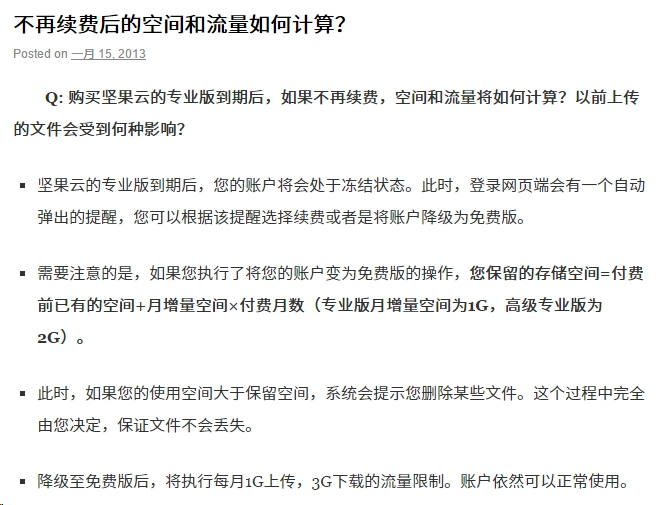
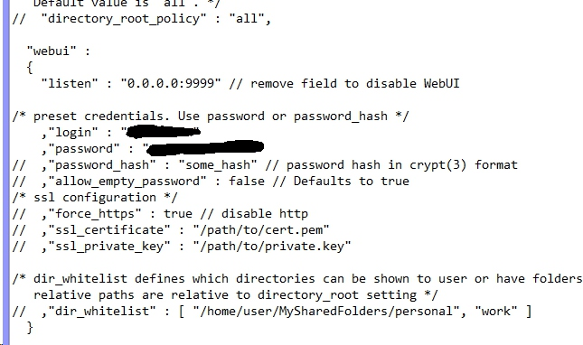
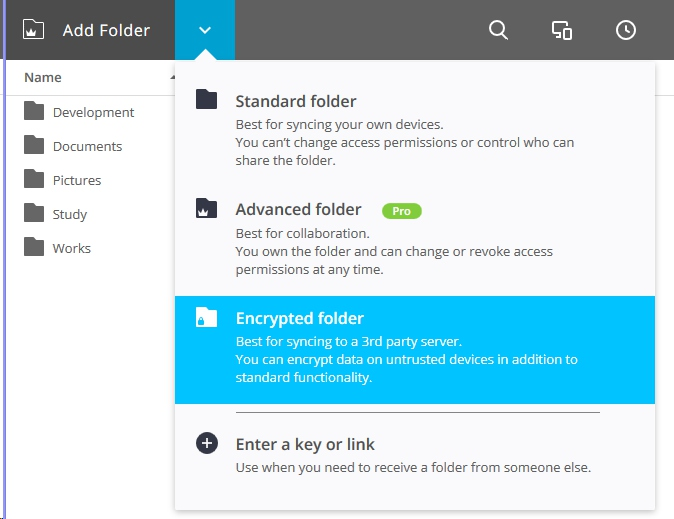
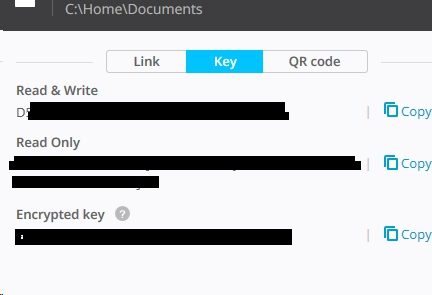
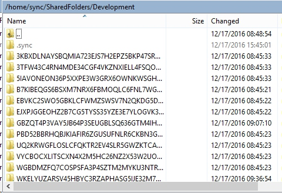
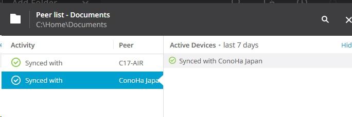

国内的云服务该倒的都倒了，剩的也都是一些残废。加上最近买了一个小笔记本随身带着，多设备间工作文件的实时同步变得非常重要。
尝试了 Dropbox 、 Google Drive 、 付费坚果云等多种云服务之后，我最终选择了 Resilio （原 BTSync ）来搭私有云。

## 1. 最初的尝试

Resilio 是基于 P2P 的文件同步服务，它把文件分散存储在参与同步的节点上，在同一子网下甚至可以通过 LAN 高速同步。类似 BT 下载的 DHT 网络保证即使客户机没有公网地址也能打洞。
起初我只在我的主电脑（几乎不关机）和随身的小电脑上部署了 Resilio ，但主电脑使用的山寨百兆宽带十分不稳定，小电脑在同样不稳定的网络下（对我说的就是你， BJUT 校园网）几乎无法连接主电脑上的节点，即使侥幸连上，速度也只有幽默的十几K。没办法，只能放弃。

## 2. 为什么放弃坚果云

然后我开始尝试各种商用云服务。国外的各类云服务虽然成熟，但速度全都非常感人。最后在各方安利之下换了坚果云。但坚果云的收费方案非常有意思，按流量收费。免费用户每月最多上传 1G，下载 3G。我数了数我需要保持同步的文件，大概有 8G 左右，精简过后也有 2.5G ，也就是说初始的同步要两个月之后才能完成。
那好吧。


付了费之后，空间方案是 30G 初始，每月 +1G， 不限流量。 我开开心心地把 2.5G 传上去了。传完之后我看到了这个：



[http://help.jianguoyun.com/?p=1582](http://help.jianguoyun.com/?p=1582)

还有这个：


[http://help.jianguoyun.com/?p=1366](http://help.jianguoyun.com/?p=1366)

我擦，我真是九脸蒙蔽。下个月我断供就不能用了？想用至少续费三个月？而且假如我过了几个月又有大量数据要传，还得先补上上次付费和这次付费之间断供的时间？

一个月 30，还是有点贵的，数据还被掐在人家手里，不值得。
你可以说我付不起钱穷之类的，我只是觉得不值得。有30块我干嘛不给我的 VPS 升一下级？

## 3. 重新部署 Resilio

坚果云还剩27天，但我已经不想用了。我又重新研究了一下 Resilio ，觉得我可以在我的 VPS 上部署一个 Resilio 作为同步节点。在外网时，小电脑可以通过稳定的 VPS 保持同步。和大电脑在同一内网下时，又可以通过 LAN 快速完成。我的 VPS 是 ConoHa 东京节点，国内访问除了电信有时候丢包厉害点，速度还 OK。
Resilio 支持加密分享，也就是说部署在 VPS 上节点的文件可以是加密过的，在 VPS 端无法读取。
而且如果有条件，可以部署多个 VPS 节点，比如在阿里云或者腾讯云上部署一个，加快国内访问速度。节点之间可以保持同步。
我的服务器系统是 Cent OS，安装 Resilio 只需要导入 yum 源，再导入公钥即可。参考[官方文档](https://help.getsync.com/hc/en-us/articles/206178924)。
新建`/etc/yum.repos.d/resilio-sync.repo`
内容为：

``` bash
[resilio-sync]
name=Resilio Sync $basearch
baseurl=http://linux-packages.resilio.com/resilio-sync/rpm/$basearch
enabled=1
gpgcheck=1
```

然后添加公钥：
`rpm --import https://linux-packages.resilio.com/resilio-sync/key.asc`
再用 yum 安装：
`yum install resilio-sync`

安好后准备一下同步目录和配置文件：

``` shell
mkdir /home/sync
chmod -R 755 /home/sync
cd /home/sync
rslsync --dump-sample-config > rslsync.conf
```

编辑配置文件，编辑一下你的机器名、端口号、用户名密码之类的。文件里的说明很详细。我就不多说了。



然后载入配置文件
`rslsync --config /home/sync/rslsync.conf`
并把这条命令加到 rc.local 开机启动，保证每次都能加载这个配置。
配置一下防火墙之后，就可以通过 ip:9999 来访问了。
登进去之后就跟本地客户端一样啦。在本机的 Resilio 添加同步文件夹，类型选择加密。



会出现三种密钥。



在 VPS 的 resilio 中添加第三个加密密钥，在小电脑的 resilio 中添加读写密钥。
这样，大小电脑上的修改都会同步到对方以及 VPS，但 VPS 端文件的变化不会同步到本地机器，保证数据安全。两台电脑上文件同步时，VPS 可以作为加速节点。而且 VPS 端的文件全部是加密过的，如图。



这样即使放到国内的主机上也可以放心数据安全。



在节点列表中可以看到另一台电脑和服务器。
如果购买 Pro 授权，还可以选择性同步。未同步的文件会显示为 0KB 占位符，当双击调用或者手动同步时才主动下载。Resilio 的同步是差分增量的，文件会被分割，只同步变化的区块。
购买了 Pro 授权之后可以把两台电脑关联为同一账户，添加的文件夹会自动同步到两台机器上，不用在小电脑上手动添加读写密钥。但注意不要在云端使用同一账户，否则不会加密。
这个 Pro 授权国内99块人民币，终身授权。比坚果云不知高到哪里去了。
氪！


参考了：
[http://maokwen.tk/2016/10/14/build-a-private-cloud-on-vps.html](http://maokwen.tk/2016/10/14/build-a-private-cloud-on-vps.html)
[https://www.freehao123.com/pcloud/](https://www.freehao123.com/pcloud/)
[http://www.dongcoder.com/detail-176844.html](http://www.dongcoder.com/detail-176844.html)

<p align = right>
by Sykie Chen
2016.12.17
</p>