今天在微博上看到一个找狗的[小游戏](http://m.weibo.cn/client/game?sinainternalbrowser=topnav)： 

简单地说就是在一堆表情里找出 doge 的表情，限时一分钟。 
作为一个~~程序猿~~手贱人，我第一反应就是要去刷掉这个榜单。 

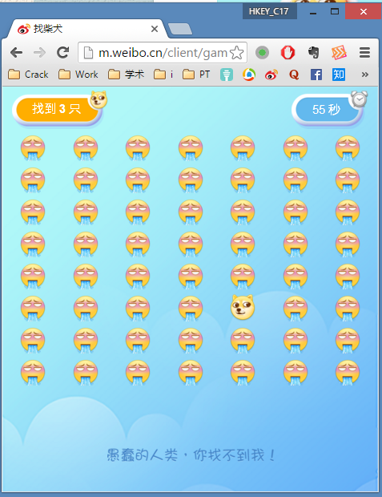

首先想到用按键精灵的自动搜图去自动点击，于是迅速写了个简单的脚本： 

``` vbscript
FindPic 0,0,1600,1000,"Attachment:\doge.bmp",0.5,intX,intY
If intX > 0 And intY > 0 Then 
	MoveTo intX + 15, intY + 15
	LeftClick 1
End If
```

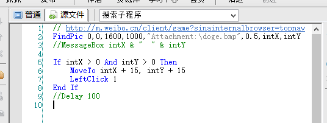 

执行之后刷出了161分： 

 

由于按键精灵的解析速度有限，161分基本是一分钟内能刷出的上限了，难以搞一个更大的新闻出来。于是就想到了直接修改代码。 
这里有两条路可走，一是修改游戏代码本身，以类似于游戏修改器的思路改成绩，或者干脆延长总时间。再一个就是伪造游戏结束时向服务器发的比分数据，直接改成绩。 
根据经验判断后者应该更方便，于是开 Fiddler 抓包： 

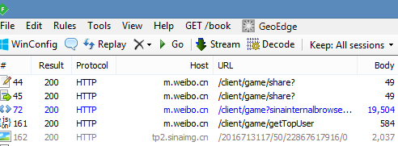 

发现在时间剩余十秒时会向服务器请求当前前20名的用户列表，是一个 json，地址是 http://m.weibo.cn/client/game/getTopUser ： 

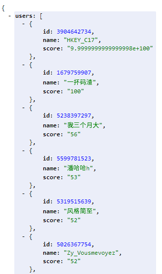 

图里的前两名都是我刷出来的，不要在意。 
注意当一局游戏结束的时候，如果不点击分享到微博，分数是不会上传到服务器的，榜单里也不会更新你。单击分享后会自动生成一条微博，并随机艾特三个人。微博为了推广真是够恶心的。 

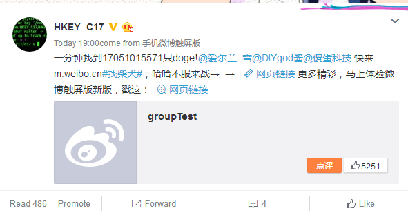 

抓分享的包，发现请求中有两个值，score 和 st： 

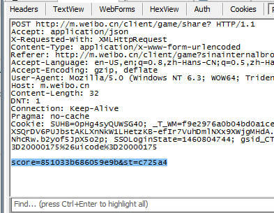 

score 无疑是本场分数了，st 根据我的多次抓包判断，是标记当前用户 id 的值。所以我们修改的重点在 score 上。 
这个 score 加密过，看长度不是 md5，尝试了常见的加密方式均不能解密。重复试验几次也没有发现规律： 

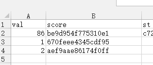 

陷入僵局，决定先分析页面源码。 

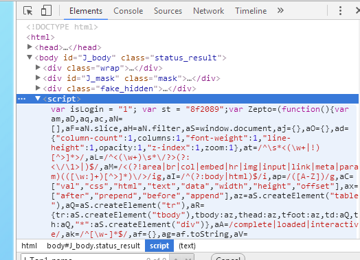 

在页面中的 JavaScript 发现了大新闻，加密函数是写在里面的： 

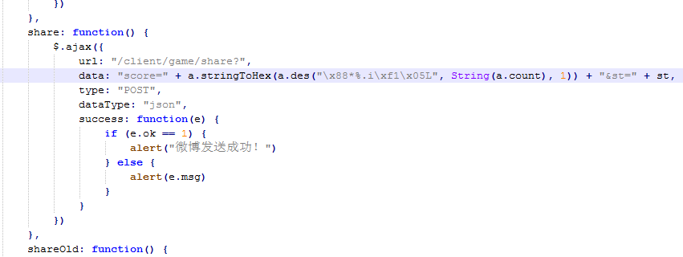 

这就好办了，直接把整个 a 这个类抠出来，新建个 js 放进去在本地执行就好。可以算出想要的任意值。  
先算个 65535 练练手。65535 的密文是 d0510f276a65373d。在 Fiddler 里直接修改刚才那个请求，发送后返回成功： 

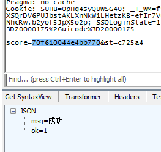 

此时自动发了一条新的微博，说我得了65535分。 
那试一下自己的手机号吧，貌似不会溢出。也成功了，图在上面就有。 
唔，那再搞个大新闻，试试 10^101 ? 

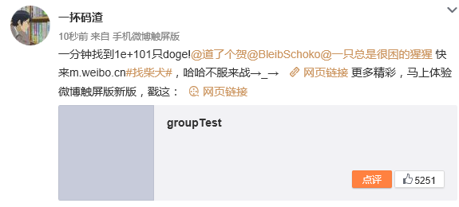 

好好好，榜单首位妥妥的是我的了，我已经吊到溢出边框了： 

 

这个时候注意到一个问题，那条微博当时就刷出来了，但榜单隔了差不多两三分钟才刷出来我那个超大的值，怀疑服务器那边卡住了。那就作个死，看看能不能搞死服务器？我们知道 JS 里有个 Infinity 的值表示无穷大，这里把无穷大带进去算，得到 b30f73e94186ee62。发送请求提示成功，但刷不出微博，刷新榜单也出不来，看来是被过滤掉了。 
好了本次作死成功完成~ 
特别感谢[小文老板](http://jobslong.com/)用 node.js 环境跑出了加密部分的 js~ 

榜单地址： http://m.weibo.cn/client/game/getTopUser 
游戏地址： http://m.weibo.cn/client/game?sinainternalbrowser=topnav 

 

摸摸大 

---

<p align = right>
by Sykie Chen
2016.4.16
</p>