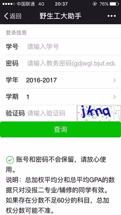
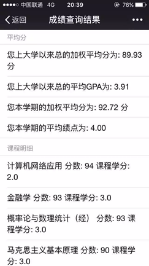

北工大查分野生助手（野生工大助手）。是[王雨峰童鞋](http://www.wangyufeng.org)带头写的一个工大查分小助手。后来申请了星火基金，现在由我和雨峰共同维护。具体说明还在写，先写更新日志。 

昨晚更新之后很多童鞋说加权和绩点都变了。是这样的，我们更新了绩点的算法，根据教务处的文件，绩点的计算也是要按学分加权的。而加权平均分的部分之前因为学校的数据格式不统一，导致了部分人的新生研讨课也被算进了加权。更新之后能识别出这部分新生研讨课，所以新的加权分就不包含研讨了，导致一部分同学的加权变化。

昨天访问量达到了 18392，谢谢大家！

以后也请大家多多支持啦！

项目地址：[https://github.com/wangyufeng0615/bjuthelper](https://github.com/wangyufeng0615/bjuthelper) 
主页：[http://chafen.bjut123.com](http://chafen.bjut123.com) 
内测版：[http://bjut.devchen.cn](http://bjut.devchen.cn)  

## 更新日志

### 2017.1.12

- 添加了更新日志。 
- 微调了总科目数的提示文字，避免歧义。 
- 修正了未通过科目数计算错误。
- 修正了中文成绩（等级）导致的科目计算错误。
- 增加了可折叠的通过/未通过成绩统计。

### 2017.1.11

- 修正了由新生研讨课的中文课程成绩和数据格式不统一导致的计算 bug。（可能会导致部分人加权分数变化）
- 修正了错误的绩点计算方式，已经更正为平均学分绩点（加权），参考 [教务处文件](http://undergrad.bjut.edu.cn/WebInfo.aspx?Id=752)。
- 更改了页面编码为 UTF-8。（但教务那边的辣鸡还是 GB2312 我们也没什么办法）

### 2017.1.3

- 移除了文件式 cookie，加快了响应和服务器负载。
- 添加了免验证码。

### 2016.12.6

- 添加了说明信息和 ICP 备案号

### 2016.12.3

- 修正了部分验证码错位的问题

### 2016.11.28

- 微调了代码架构，加强了微信浏览器的兼容性。

### 2016.7.23

- 增加了代码说明和项目说明，配了图。

### 2016.7.16

- 首次上传

## 二维码

来，扫码吧！ 
王雨峰的公众号：七系 
 
十七的空指针： 

by Sykie Chen & Alan Wang
2017.1.12

