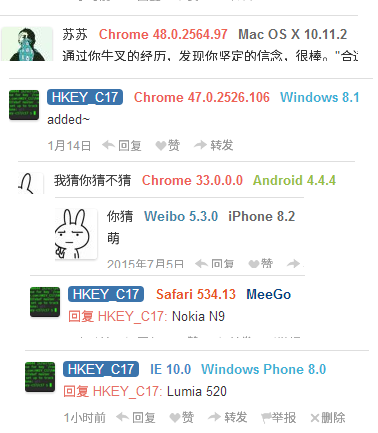

多说评论系统被很多中文网站使用。网上有很多添加站长回复标记和浏览器操作系统信息的方法。但大部分均已随着多说 JS 的更新而不再有效或存在兼容性问题。我参考了这些教程并重写了相关代码以改进显示效果。 

先上图： 

 

可以解析 IE/Egde, Chrome, Safari, Firefox, Opera 等浏览器以及常见的几种国内壳浏览器。微博微信内置浏览器也可解析。 
系统方面除了做了 iPhone/iPad 区分外，还加入了对1%的WP支持=。= 
已有的教程多修改为带圆角矩形背景的文字， ~~难看的一笔~~ 不是十分的优雅。因此我改为了无背景，彩色加粗文字。 
以及在无法识别的时候会显示 ~~奇怪♂的浏览器~~ 和 ~~奇怪♂的操作系统~~ 字样 ~~增加情趣~~ 提示用户。 

## 1. 多说 JS 和 CSS 的本地化 

多说引用的 JS 脚本地址为 `http://static.duoshuo.com/embed.js`，搞下来，改个名字或者不改也行。我这里改为 `ds_embed.js` 并放置到主题目录 `/source/js/` 中。 

多说的 CSS 分为两部分，其一为通用部分，即多说后台设置的“主题”所包含的。这部分无需本地化。其二为多说后台“自定义CSS”的部分。这部分严格来说也无需本地化，但自己写的代码还是存成自己的文件比较稳妥，也便于本地维护，放在后台谁知道它哪天抽了就没了。 

将多说后台“自定义CSS”中已有的内容剪切，写入到主题目录 `/source/css/duoshuo.css` 中。 

然后修改`多说公共JS代码`，即我在 [Hexo Landscape 主题修改优化](http://www.devchen.com/blog/coding/HTML/hexo-theme/) 一文中插入到 `layout\_partial\after-footer.ejs` 文件中的部分代码。  
原来的

``` javascript
ds.src = (document.location.protocol == 'https:' ? 'https:' : 'http:') + '//static.duoshuo.com/embed.js';
```

修改为

``` javascript
ds.src = '/js/ds_embed.js';
```

然后在 `layout\_partial\head.ejs` 中合适的位置插入 css 引用：

``` html
<link href="/css/duoshuo.css" rel="stylesheet" type="text/css">
```
更新网站，若评论框正常显示则本地化成功。 

## 2. 添加 CSS 样式

在 `duoshuo.css` 中插入以下代码：

``` css
/* duoshuo UA marks */
span.ua{
	margin: 0 3px!important;
	font-weight: bold !important;
}
.ua_other, .os_other{
	color:#000 !important;
}
.ua_ie{
	color: #428bca !important;
}
.ua_firefox{
	color: #f0ad4e!important;
}
.ua_maxthon{
	color: #7373B9!important;
}
.ua_ucweb{
	color: #FF740F!important;
}
.ua_sogou{
	color: #78ACE9!important;
}
.ua_mi{
	color: #FF4A00!important;
}
.ua_chrome{
	color: #EE6252!important;
}
.ua_qq{
	color: #3D88A8!important;
}
.ua_apple{
	color: #E95620!important;
}
.ua_opera{
	color: #d9534f!important;
}
 
 
.os_vista,.os_2000,.os_windows,.os_xp,.os_7,.os_8,.os_8_1 {
	color: #39b3d7!important;
}
 
.os_android {
	color: #98C13D!important;
}
.os_ubuntu{
	color: #DD4814!important;
}
.os_linux {
	color: #3A3A3A!important;
}
.os_mac, .os_ios{
	color: #666666!important;
}
.os_unix{
	color: #006600!important;
}
.os_nokia{
	color: #014485!important;
}

/* admin reply mark */

#ds-reset div a.sskadmin{
	background-color: #3B74AC !important;
	border-color: #3B74AC !important;
	border-radius: 4px;
	padding: 0 5px!important;
	color:#fff !important;
}

/* user name color */
#ds-reset span.ds-user-name, #ds-reset a.ds-highlight{
	/*background-color: #777 !important;
	border-color: #777 !important;
	border-radius: 4px;
	padding: 0 5px!important;*/
	color:#444 !important;
	
}
```

代码用途在注释中已有说明，不再赘述。最下面两块 `#ds-reset` 开头的样式会覆盖默认主题中的同名样式，以修改在主题中定义的用户名颜色，而不必本地化主题 CSS。 

## 3. 修改 ds_embed.js

这一步非常重要，修改不慎就会导致整个评论框无法显示。而且这部分内容也与当前的多说 js 版本相关联。本文中提到的代码基于 2016-02-12 版本的 embed.js，如果今后多说修改了相关代码可能失效，到时我应该会更新。 

### 3.1 添加新函数

首先在文件开头处添加三个新的函数： 

``` javascript
// admin reply
function sskadmin(e) {
	var ssk = '';
	if(e.user_id==11838425){
		ssk = ' sskadmin'
	}
	return ssk;
}
// UA parser
function ua(e) {
	var r = new Array;
	var outputer = '';
	if (r = e.match(/MSIE\s([^\s|;]+)/gi)) {
		outputer = '<span class="ua_ie">IE ' + r[0].replace('MSIE', '')
	} else if (r = e.match(/Edge\/([^\s]+)/ig)) {
		var r1 = r[0].split("/");
		outputer = '<span class="ua_ie">Edge ' + r1[1]
	} else if (r = e.match(/FireFox\/([^\s]+)/ig)) {
		var r1 = r[0].split("/");
		outputer = '<span class="ua_firefox">FireFox ' + r1[1]
	} else if (r = e.match(/Maxthon([\d]*)\/([^\s]+)/ig)) {
		var r1 = r[0].split("/");
		outputer = '<span class="ua_maxthon">Maxthon'
	} else if (r = e.match(/UBrowser([\d]*)\/([^\s]+)/ig)) {
		var r1 = r[0].split("/");
		outputer = '<span class="ua_ucweb">UC ' + r1[1]
	} else if (r = e.match(/MetaSr/ig)) {
		outputer = '<span class="ua_sogou">Sougou'
	} else if (r = e.match(/MicroMessenger\/([^\s]+)/ig)) {
		var r1 = r[0].split("/");
		outputer = '<span class="ua_qq">WeChat ' + r1[1]
	} else if (r = e.match(/QQBrowser\/([^\s]+)/ig)) {
		var r1 = r[0].split("/");
		outputer = '<span class="ua_qq">QQ ' + r1[1]
	} else if (r = e.match(/QQ\/([^\s]+)/ig)) {
		var r1 = r[0].split("/");
		outputer = '<span class="ua_qq">QQ ' + r1[1]
	} else if (r = e.match(/MiuiBrowser\/([^\s]+)/ig)) {
		var r1 = r[0].split("/");
		outputer = '<span class="ua_mi">MIUI ' + r1[1]
	} else if (r = e.match(/Chrome([\d]*)\/([^\s]+)/ig)) {
		var r1 = r[0].split("/");
		outputer = '<span class="ua_chrome">Chrome ' + r1[1]
	} else if (r = e.match(/safari\/([^\s]+)/ig)) {
		var r1 = r[0].split("/");
		outputer = '<span class="ua_apple">Safari ' + r1[1]
	} else if (r = e.match(/Opera[\s|\/]([^\s]+)/ig)) {
		var r1 = r[0].split("/");
		outputer = '<span class="ua_opera">Opera ' + r1[1]
	} else if (r = e.match(/Trident\/7.0/gi)) {
		outputer = '<span class="ua_ie">IE 11'
	} else if (r = e.match(/weibo__([^\s]+)/ig)) {
		var r1 = r[0].split("__");
		outputer = '<span class="ua_qq">Weibo ' + r1[1]
	} else {
		outputer = '<span class="ua_other">奇怪♂的浏览器'
	}
	return outputer+"</span> ";
}
function os(e) {
	var r = new Array;
	var os = '';
	if (e.match(/Windows/ig)) {
		if (e.match(/NT 5.1/ig)) {
			os = '<span class="os_xp">Windows XP'
		} else if (e.match(/NT 6.1/ig)) {
			os = '<span class="os_7">Windows 7'
		} else if (e.match(/NT 6.2/ig)) {
			os = '<span class="os_8">Windows 8'
		} else if (e.match(/NT 6.3/ig)) {
			os = '<span class="os_8_1">Windows 8.1'
		} else if (e.match(/NT 10.0/ig)) {
			os = '<span class="os_8_1">Windows 10'
		} else if (e.match(/NT 6.0/ig)) {
			os = '<span class="os_vista">Windows Vista'
		} else if (e.match(/NT 5/ig)) {
			os = '<span class="os_2000">Windows 2000'
		} else if (r = e.match(/Phone OS ([^\s]+)/ig)) {
			//WP7-7.5
			os = '<span class="os_windows">Windows ' + r[0].split(';')[0]
		} else if (r = e.match(/Phone ([^\s]+)/ig)) {
			//WP8+
			os = '<span class="os_windows">Windows ' + r[0].split(';')[0]
		} else {
			os = '<span class="os_windows">Windows'
		}
	} else if (r = e.match(/android ([^\s]+)/ig)) {
		os = '<span class="os_android">' + r[0].split(';')[0]
	} else if (r = e.match(/iPhone OS ([^\s]+)/ig)) {
		os = '<span class="os_ios">' + r[0].replace('iPhone OS', 'iPhone').replace('_', '.').replace('_', '.')
	} else if (r = e.match(/CPU OS ([^\s]+)/ig)) {
		os = '<span class="os_ios">' + r[0].replace('CPU OS', 'iPad').replace('_', '.').replace('_', '.')
	} else if (e.match(/ubuntu/ig)) {
		os = '<span class="os_ubuntu">Ubuntu'
	} else if (e.match(/linux/ig)) {
		os = '<span class="os_linux">Linux'
	} else if (r = e.match(/Mac OS X ([^\s]+)/ig)) {
		os = '<span class="os_mac">' + r[0].split(')')[0].replace('_','.').replace('_', '.')
	} else if (e.match(/unix/ig)) {
		os = '<span class="os_unix">Unix'
	} else if (e.match(/symbian/ig)) {
		os = '<span class="os_nokia">Symbian'
	} else if (e.match(/meego/ig)) {
		os = '<span class="os_nokia">MeeGo'
	} else {
		os = '<span class="os_other">奇怪♂的操作系统'
	}
	return os+"</span>" ;
}
```

其中第一个函数中的 `11838425` 是我的多说 user ID，在多说后台查看。 
浏览器解析的部分我没有加入太多的国产壳浏览器解析，我觉得访问这个网站的人应该不会 low 到用大数字之类的奇怪浏览器吧。 

### 3.2 修改输出格式

查找 
`r.url?(t+='<a class="ds-user-name ds-highlight"` ... 
这部分代码 
在 class 中插入一段，变成： 

`r.url?(t+='<a class="ds-user-name'+sskadmin(s.author)+' ds-highlight" data-qqt-account="'+(r.` ... 

这步是添加了站长回复的标记 
后边不远处有一段 

`t+=' data-qqt-account="'+(r.qqt_account||"")+'">'+u(r.name)+"</span>"),` 

在这后面插入以下代码： 

``` javascript
// UA parse
t+='<span class="ua">' + ua(s.agent) +'</span><span class="ua">'+ os(s.agent) + '</span>',
```

这一步是添加了 UA 信息显示 

更新网站，查看评论框效果，如果评论框不显示则说明 JS 写得有问题，可能的原因有： 
1. 多说 JS 版本更新了，部分对象名改变； 
2. 你复制错了。(\*/ω＼\*) 


修改后的完整代码在 GitHub: https://github.com/SykieChen/hexo-theme-hic17/blob/81343b17064034d09d1c51d6e44829dcbb57a5eb/source/js/ds_embed.js 

本文的所有修改均已合并到 HiC17 Hexo主题中。地址： https://github.com/SykieChen/hexo-theme-hic17 

---

参考了： 
http://myhloli.com/duoshuo-ua-and-admin-tab.html 
http://ssk.91txh.com/209 
https://segmentfault.com/a/1190000002707162 

---

<p align = right>
by Sykie Chen
2016.2.12
</p>