## 0.1 污染情况

最近北京的空气又爆炸，污染300多已经算低了。昨天晚上空气指数400多的时候下楼拿外卖，一进走廊就能明显感觉到嗓子火辣辣的，我立刻回头戴上了 9502 口罩，然而电梯到一楼一开门时隔着口罩也能闻到空气中呛人的味道。一出楼门，能见度不足二十米，甚至觉得眼睛都开始不适。隔着口罩也能感觉到空气的味道更加明显。

前段时间空气污染 800+ 的时候我曾经用两天时间将一个 9501V 口罩戴得漆黑一片。加上最近嗓子不舒服的频率越来越高，我决定好好研究一下呼吸防护的问题。

## 0.2 防护手段
首先要明确一下各种呼吸防护等级标准，如下表：

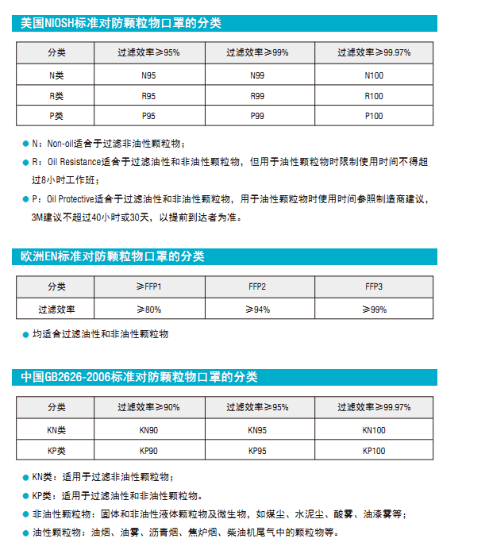

N只防干性颗粒，P与R可以防油性颗粒。不幸的是，机动车尾气大部分由油性颗粒组成。交通部说空气污染是供暖的锅，住建部说空气污染是汽车尾气的锅。根据我戴 9502 口罩还能闻到雾霾味道这个情况来看，我倾向于相信住建部的说法。即佩戴 N95 等级的口罩（如 3M 9501/9502）并不能完全抵御雾霾。N90 等级（如 3M9001/9002/9003(V)）的就更别提了。

我又查阅了 P95 等级口罩（如 3M 8577/8576），售价均为 20+ RMB，根据之前重污染时2-3天更换一个的频率我是难以负担的。相比于 N95 口罩2-3 RMB 的售价不知高到哪里去了。

在查阅的过程中我了解到不光可以戴口罩，还可以直接上可以重复使用的面罩。面罩首次购买成本较高，但使用时更换的耗材成本相较于一次性口罩低了不少。
面罩就分为半面罩和全面罩。全面罩如图所示，随便感受一下。

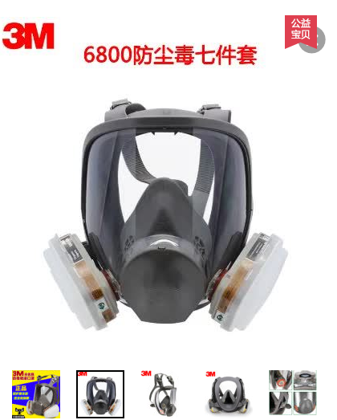

生化危机既视感。戴出去太夸张了，而且售价也十分可观，图里的 6800 七件套 400+ RMB。
半面罩没有护目镜部分，造型更加正常一些，价格也在可以接受的程度内。

3M 的面罩有一大堆：

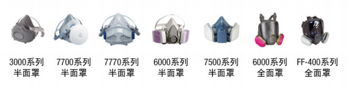

卖的比较好的主要有 6000、7500 和 3000 系列，别的有什么区别我也没太看出来，就不研究了。
半面罩的主要组成有本体、滤毒盒、过滤棉和过滤棉盖。不使用滤毒盒时可以将滤毒盒更换为过滤棉底座+过滤棉或直接接过滤棉。具体的图见下。下面分别讲一下各部分。

## 1. 面罩主体

3000 系列有 3100 小号、3200 中号和 3300 大号，分别给女性、男性和大脸男性使用。
说我要用 3300 那些你们过来，我保证不打死你们。
###1.1 3000 系列###
有一个滤毒盒承接口，应对平时的小流量呼吸无压力，运动时佩戴可能就比较捉急了。
3200 面罩搭配滤棉底座如图：

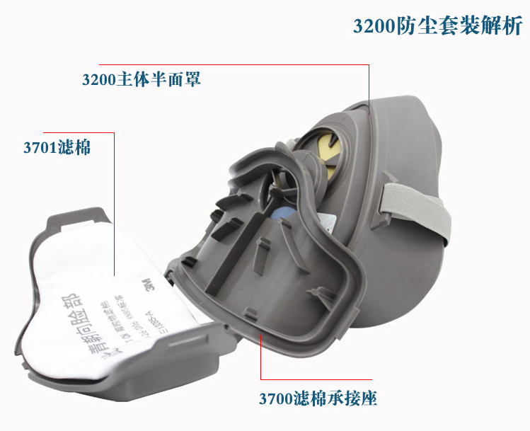

3200 搭配滤毒盒如图：

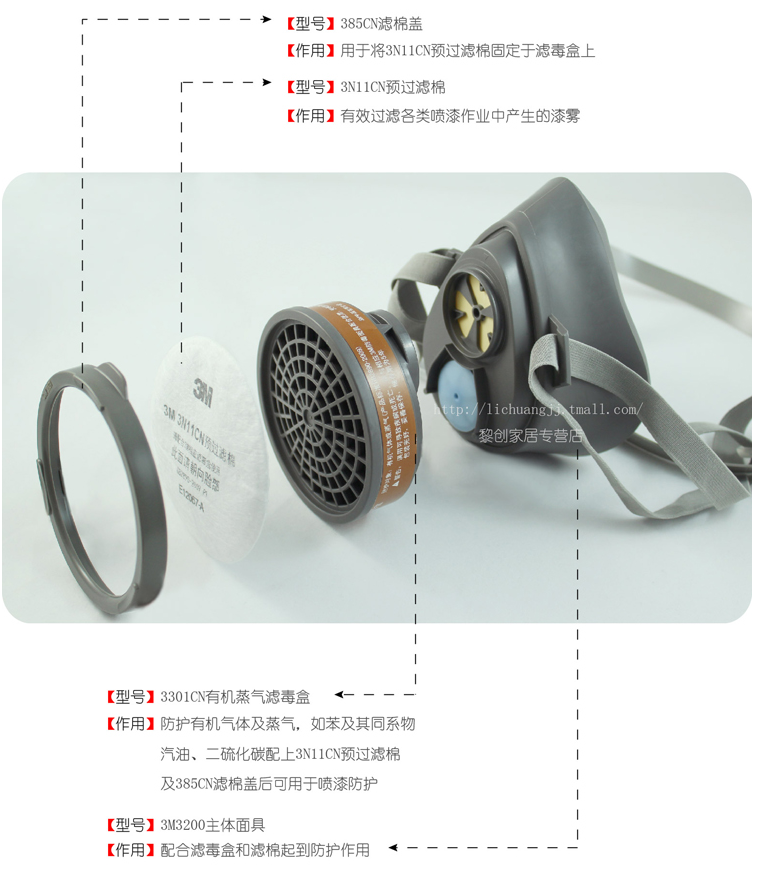

### 1.2 6000 系列

有两个滤毒盒/过滤棉接口，可以应对大流量的呼吸，阻力较小，缺点是造型太特么夸张了，而且很重，戴久了脖子必然难受。同样分为 6100/6200/6300 对应不同大小的脸。

6200 的各种搭配如图：

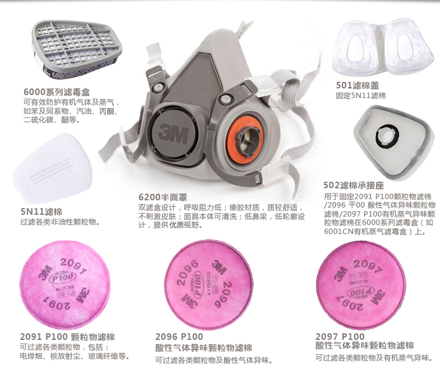

配滤毒盒的戴上效果如图：

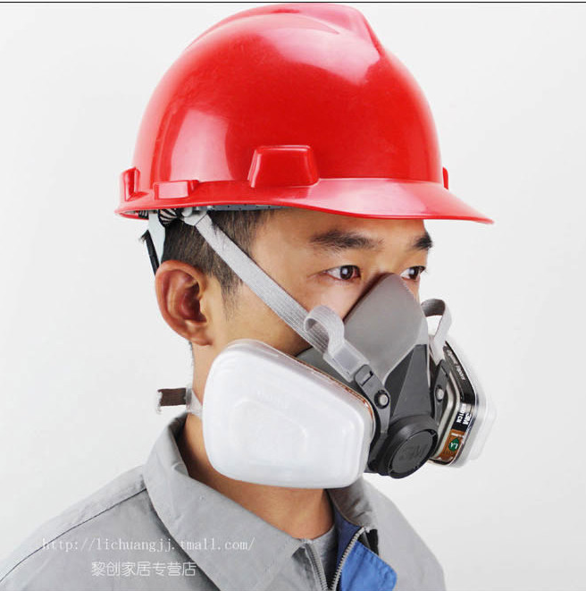

### 1.3 7500 系列

跟 6000 系列的区别基本只在于 7500 是硅橡胶的，更舒服一点。同样分为 7501/7502 对应脸部大小。

7502 如图：

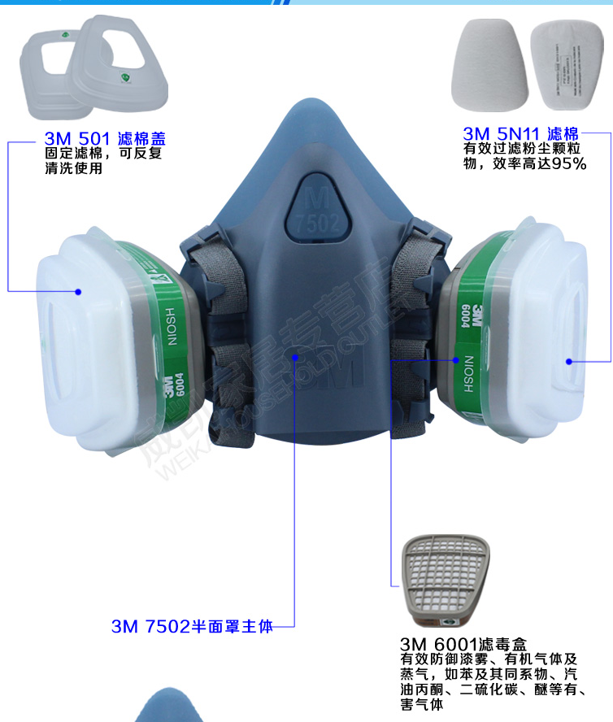

## 2. 过滤棉

过滤棉对应不同的面罩有不同的型号，根据国家标准 GB2890-2009，等级分为三种：

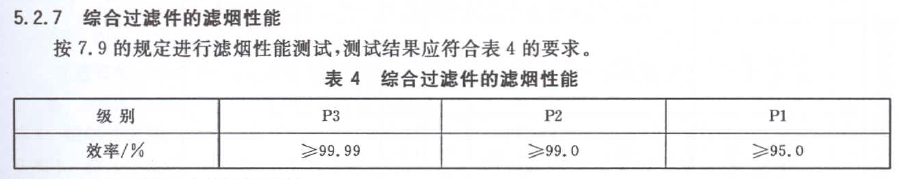

即最基本的 P1 型也有 N95 的过滤效果。
在 3M 官网摘抄如下：

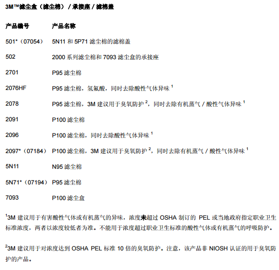

来源：http://multimedia.3m.com/mws/media/483537O/7500.pdf

其中 2000 系列滤棉直接接在面罩上，5N/3N 系列滤棉要配合滤毒盒使用。
3N11 滤棉的图参考上面 3200 面具的图。
2091 滤棉如图所示：

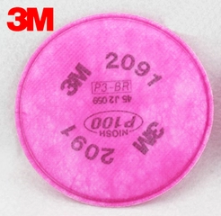

迷人的粉色，妹子可以考虑一下=。=

## 3. 滤毒盒

终于到了重点了，滤毒盒这个东西如果不装的话，面罩的优势就体现不出来了。
一个滤毒盒可以使用一个月左右（每天8小时）。主要分类如下：

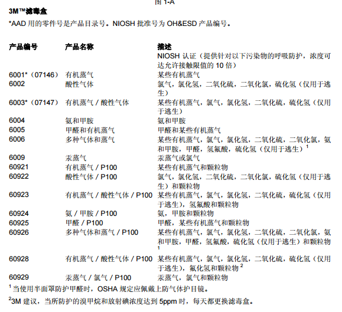

所有的滤毒盒上都有颜色环，颜色遵循国家标准 GB2890-2009：
来源：http://www.fjcodc.com.cn/article/download.jsp?ufid=769&idx=0

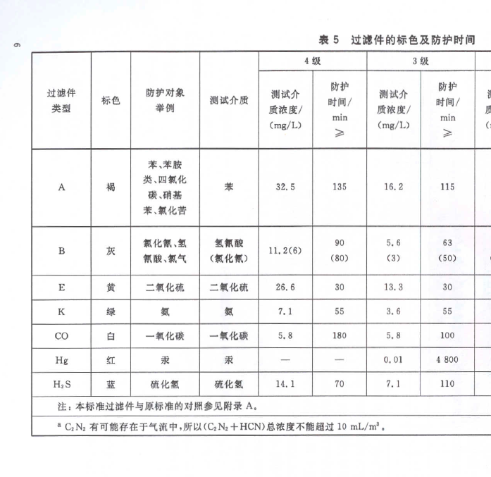

常用的有 6001/3301 和 6003/3303 滤毒盒，6000 和 3300 系列分别对应相应的半面具。
6001/3301 主要防有机气体，褐色环：

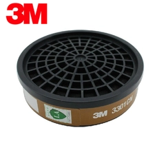

6003/3303 还兼防二氧化硫气体，褐色、黄色双环，但是比 6001/3301 贵二十多块钱，不过我觉得这个钱还是有必要的，毕竟尾气里二氧化硫含量不低。

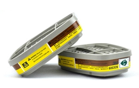

## 4. 总结

终于简单地说完了，各种型号真是要人命。总结起来我决定买 3200面具 + 3303滤毒盒 + 3N11滤棉 组合，全套售价 60-70 元左右，每周更换一次 3N11 滤棉，售价 1.6 元，每月更换一次  3303 滤毒盒，售价 34 元。
对于爱出汗的人有个神器，3M 389 吸汗垫，售价 2-3 元：

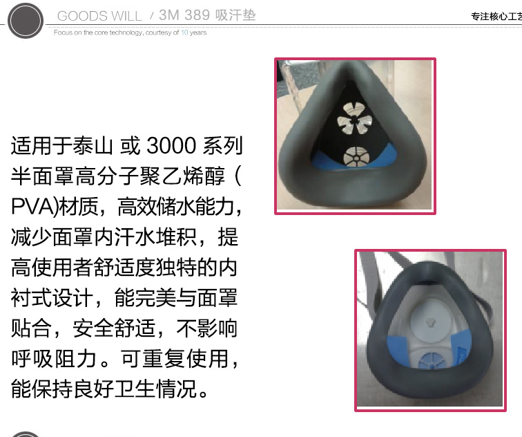

这个组合基本在保命和看起来正常之间取得了平衡= =
其实这个污染情况看起来正不正常已经不那么重要了。我已经好几次在学校里看见戴着巨大的带俩滤毒盒的 6200 面罩的妹子了，在生存面前，好不好看先缓一缓吧。选择了北京为的是更好的发展环境，污染的空气也是选择的一部分。自己选的霾，跪着也要吸完。

最后不得不说，3M 真是人民的好帮手，生活的好伙伴啊= =

祝大家生活健康，不被熏死= =
以上涉及产品在 `X宝` 都能买到

参考：
http://www.zhihu.com/question/38273401
http://www.zhihu.com/question/25953227
http://www.zhihu.com/question/20749979
http://www.fjcodc.com.cn/article/download.jsp?ufid=769&idx=0
http://multimedia.3m.com/mws/media/652862O/2091p100.pdf
http://multimedia.3m.com/mws/media/483537O/7500.pdf
http://multimedia.3m.com/mws/media/5184O/particulate-filter-2096-p100.pdf

by Sykie Chen
2015.12.13

