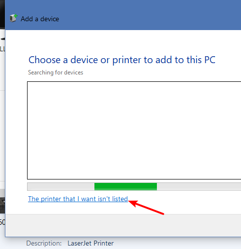
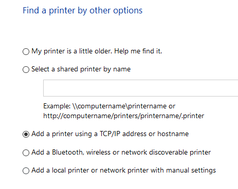
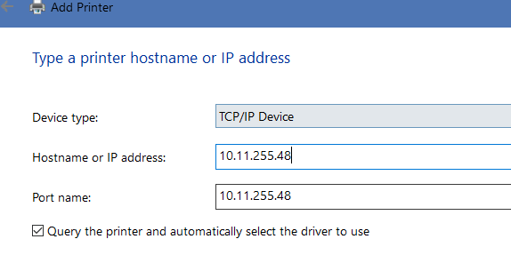

1. 控制面板查看打印机属性，复制 IP 地址
2. 删除网络打印机
3. 添加打印机，选择未列出打印机

    

4. 使用 TCP/IP 添加打印机

    

5. 选 TCP/IP 设备，填入 IP 地址，端口名是虚拟硬件端口名，不是 TCP 端口，随便起名。

    

6. 浏览设备驱动中定位到驱动目录，选择正确型号。

[创宇打印机驱动](http://h30318.www3.hp.com/pub/softlib/software13/COL32431/bi-80329-11/hp_LJP1100_P1560_P1600_Full_Solution-v20120831-50157036_SMO.exe)  
型号: `HP LaserJet Professional P1606dn`  
IP: `10.11.255.47`