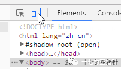

北京联通的校园201宽带一直限制登陆数。以前我们使用用户名添加 @wo201 ，密码添加 /001 字符的方式直接路由器拨号。但七月中旬一次更新之后该方法失效，加密方式改变。

最近不少人回学校了问我怎么拨号，写个教程比较方便。

**先介绍一下新的 pppoe 加密方式**

参考了 [FanZheng's blog](https://fanzheng.org/archives/17#7) ：

只是想知道怎么上网的可以跳过这段。

> 
> - 真实账号=账号+`@wo201`（这个跟原来的没有变化）
> - 真实密码=动态pin码+密码
>
>而这个动态pin码，是访问http://114.247.41.50:9343/aaa/get/pin?user=账号这个地址返回的json数据中的pin字段。它是个6位数字，大约10秒会更新一次。
>
>也就是说，在这种加密方式下，想要使用PPPoE拨号，就得在10秒内完成获取pin码、填写密码和进行拨号的步骤，对于路由器来说，还是有点麻烦的。最关键的是每次拨号都要改一下密码，因此操作频率就取决于路由器是否断电以及联通设置的一次拨号的最长连接时间了。
>

那个返回动态验证码的页面，传入的账号即使是随机数字也能返回，说明是服务器端的一个算法动态生成的。

**再介绍一下现在可行的拨号方式**

1. 如果想继续使用路由器自动 pppoe 拨号，需要刷了 op 等智能系统的路由器，写脚本获取动态密码。技术上没有难度，过程上比较繁琐。此处略过。

2. 如果想使用官方推荐的方式拨号，即拨号后只能本机上网。可以将路由器 DHCP 关掉，LAN 口插猫，当作交换机使用，并在电脑上下载新的官方客户端直接拨号。

3. **如果想继续分享使用宽带，但不会方法1**，使用原来的网页入口登录即可。这也是我比较推荐的简易方法。

首先将路由器获取地址方式改为动态 IP，关闭路由器拨号，打开 DHCP，路由器 WAN 口接猫。

然后使用手机连接路由器，随便打开一个网页，弹出如图界面。

输入你的宽带用户名密码登录。登录后路由器下其他设备也可上网。断网后需重新登录。

如果没有手机，使用 Chrome 浏览器，按 F12 打开开发者模式。按图中按钮打开移动端模拟。然后随便打开一个网页，会弹出和上图相同的手机登录页，照前操作即可。

如果想自动拨号，使用 curl 或者用 python 等语言模拟网页登录发包即可。包的内容很简单，使用 Fiddler 抓包即可查看，也可以用 Chrome 开发者模式直接抓包。会写的都会抓，我就不废话了。

最后，垄断校园宽带限制终端数的运营商都去吔屎啦。

