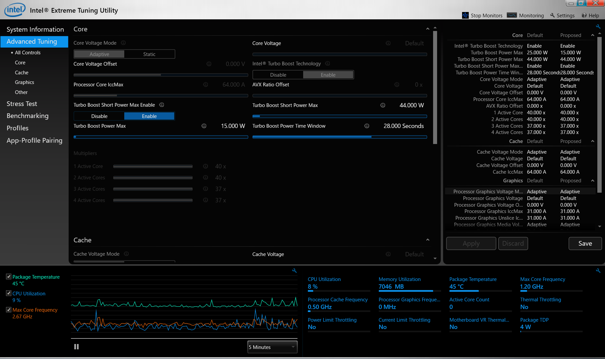
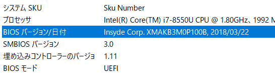
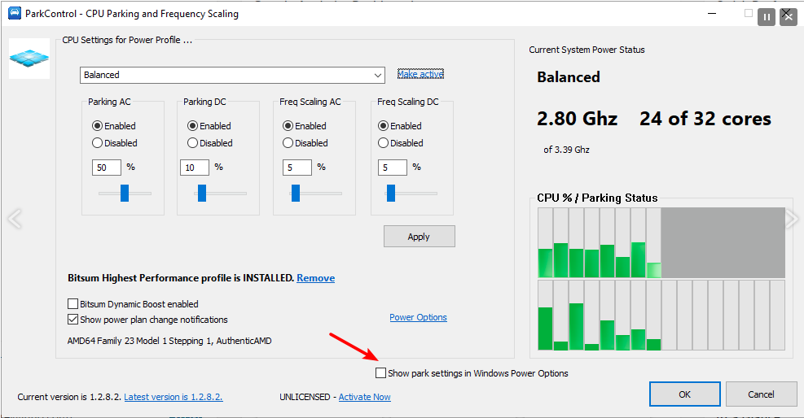
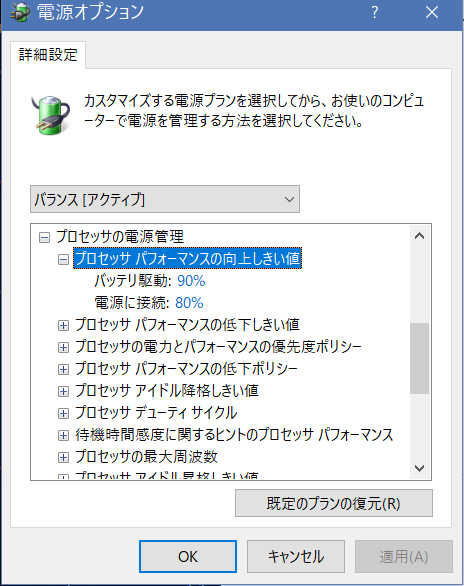
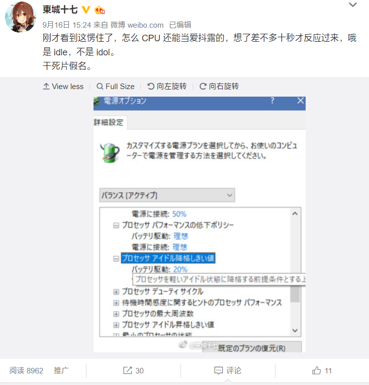

买了这个带指纹的小米十三寸之后，别的什么都好，就是一插交流电，CPU 温度就噌噌噌上来了，风扇也跟着起飞。不插电源用电池的时候就很安静。
查了好多资料，包括一些买了小米的忧伤老外写的东西，建议无非是四个：

1. 装 XTU 调核心电压；
2. 装 [Notebook Fan Control](https://github.com/hirschmann/nbfc) 调风扇转速；
3. 刷 BIOS 玄学降温；
4. 在电源策略里限制 CPU 最大频率为 99%。

首先 Inten XTU 是不好使的，新版 BIOS 早就封死调电压的入口了。而且其实也不是 CPU 电压的问题，而是 Windows 的电源策略太激进。我曾经刷回旧版 BIOS 调低了 CPU 核心电压，几乎没有效果。

然后装风扇转速控制我也试过，治标不治本，小米这个风扇是有点过于主动，但如果调低转速机器就会非常烫，不是问题的根源。

刷 BIOS 我试过网上传出的两个版本，又去小米售后专门刷了最新版：

不负责任地讲一句，没卵用。  

限制 CPU 频率的办法确实好用，但这是以牺牲性能为代价的，调到99%之后禁用了睿频，那我花那么多钱买这 i7 有何用？  

研究好久终于发现问题的根源是 Windows 的电源策略。 
相关控制参数在电源方案里设置，但默认隐藏。 
通过修改注册表可以显示，但相当麻烦。 
参考： 
<http://forum.notebookreview.com/threads/guide-power-options-power-plans-show-all-hidden-settings.767612/>  
<https://docs.google.com/spreadsheets/d/17XBNNdMdX-Bkt1kb8dJW3FP4br0VL7G94tdFBo8SW48/edit?pli=1#gid=870536397>

因此使用小软件 [ParkControl](https://bitsum.com/parkcontrol/) 解决：

安装后勾上这个就可以卸载了。（其实这个小软件本来的功能是解锁 CPU 停车设置，让 CPU 工作得更猛烈一些的） 
然后在电源计划里修改相关的值：  

搞成和电池状态差不多就行了，尤其是第一个升频阈值，默认是60%，一不小心就升频了。 
保存之后重启（可能不重启也行），妈妈再也不担心我插电的时候风扇上天了。

神他妈爱抖露，偶像CPU。  

<https://weibo.com/6174652641/GzCzRpTkM>